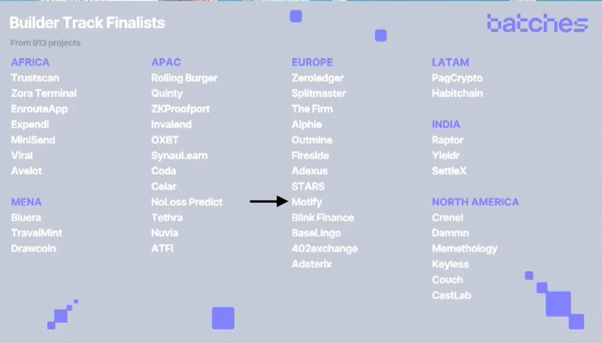
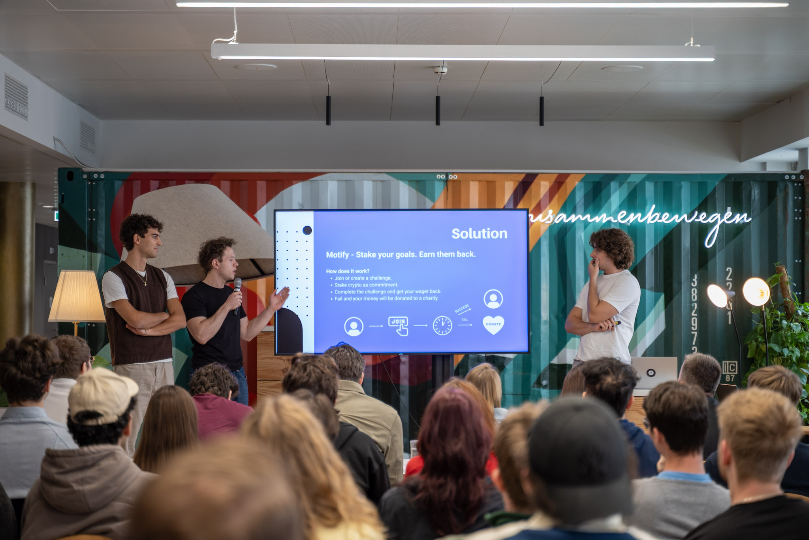
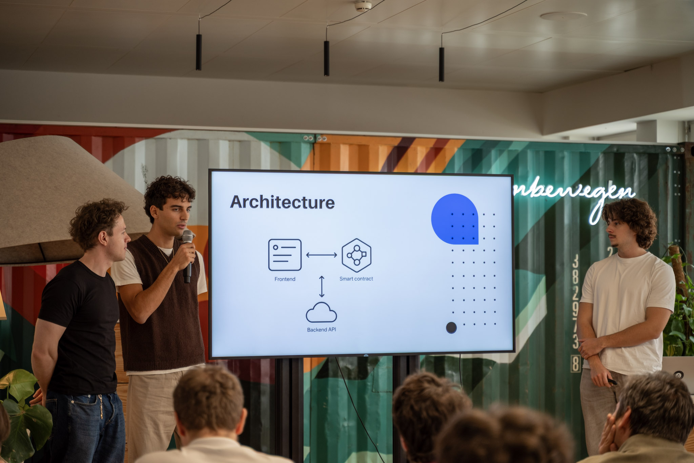
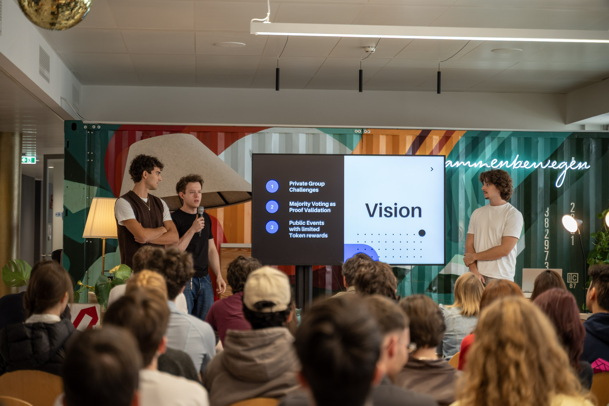
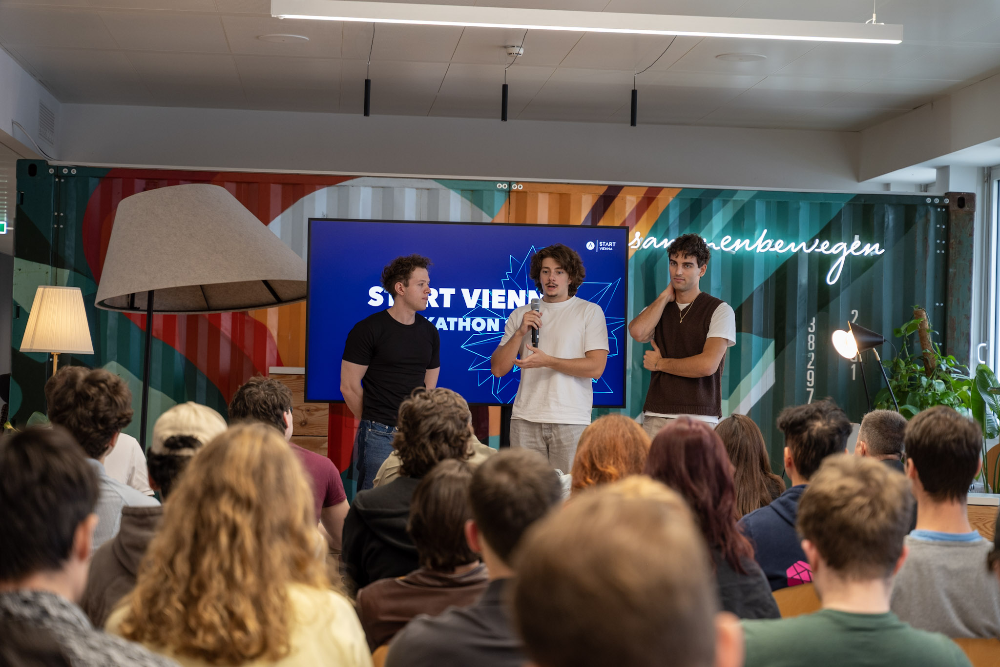
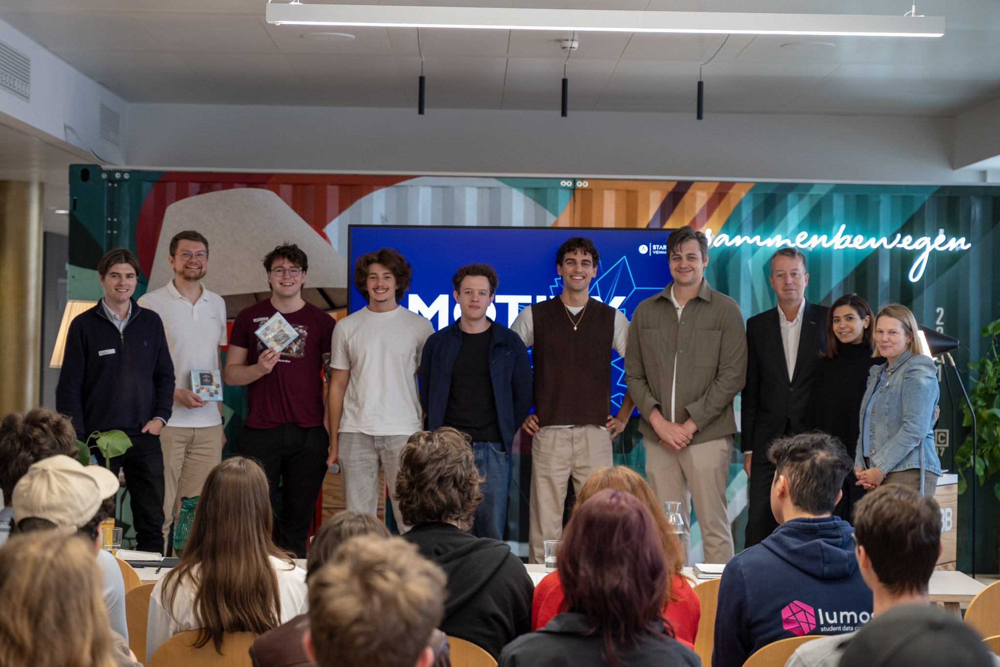

# Motify – Project Showcase

> **A Web3 Accountability App Built on Base**

## 🎬 Demo Video

*Click to watch the full demo on YouTube*

---

## 🏆 Project Overview

**Motify** is a Web3 application built on **Base (Coinbase's L2)** that leverages smart contracts and wallet integrations to enable on-chain execution and token-based accountability incentives.

| | |
|---|---|
| **Domain** | Web3 · Smart Contracts · Wallet Integration · On-chain Incentives |
| **Tech Stack** | FastAPI · Supabase · Web3.py · React · Solidity |
| **Blockchain** | Base (L2 Ethereum by Coinbase) |

---

## 🔗 Links & Resources

| Resource | Link |
|----------|------|
| 🎬 Demo Video | [YouTube](https://youtu.be/7yhsUFMNui4?si=MOPQ7W9MtYeelZBL) |
| 🌐 Live Product | [motify.live](https://motify.live/) |
| 📋 Devfolio Application | [Project Page](https://devfolio.co/projects/test-a97f) |
| 💻 Frontend Repo | [GitHub](https://github.com/eliaslehner/Motify) |
| 📜 Smart Contracts | [GitHub](https://github.com/etaaa/motify-smart-contracts) |

---

## 💡 Motivation – How It All Started

The project started during **Start Hackathon Vienna**, where Base (by Coinbase) provided a real-world case challenge to work in **36 hours**:

> **Build a meaningful product on the Base ecosystem.**

Our motivation was to:
- Build something **production-oriented**, not just a hackathon demo
- Learn how to work with **Base, smart contracts, and wallet execution**
- Combine entrepreneurship, product thinking, and technical depth

---

## 📈 Project Lifecycle

### 1️⃣ Ideation & Prototype (Start Hackathon Vienna)

- Developed the **core idea and product vision**
- Designed the **on-chain logic and incentive structure**
- Built a **working prototype** and pitch deck
- **Outcome:** 🏆 **Winner Overall** of the Hackathon (Base / Coinbase Case Challenge)

### 2️⃣ Validation & Scaling (Base Global Buildathon – Devfolio)

- Motivated by the local win, we applied to the **global Base Buildathon**
- Competing against **900+ teams worldwide**
- Expanded from prototype → **functional MVP**
- Implemented:
  - Live smart contracts
  - Wallet execution
  - Backend + frontend integration
- **Outcome:**
  - 🎖 **Top 50 projects selected globally**
  - 💰 **$5,000 Builder Grant from Base**
  - 🚀 Live MVP & demo deployed

  

### 3️⃣ MVP & Live Product

- Fully integrated **frontend, backend, and on-chain components**
- End-to-end flow:
  - Wallet connection
  - Smart contract interaction
  - Token execution on Base
- Focus on **stability, demo-readiness, and real usage**

---

## 🎯 Key Achievements

| Achievement | Description |
|-------------|-------------|
| 🏆 **Hackathon Winner** | Winner of Start Hackathon Vienna |
| 🌍 **Top 50 Global** | Selected from 900+ teams in Base Global Buildathon |
| 💰 **$5,000 Grant** | Base Builder Grant from Coinbase |
| 🔗 **Live MVP** | Deployed and running on Base mainnet |
| 🎤 **International Pitch** | Presented to a global Web3 audience |

---

## 🧗 Challenges

- Coordinating **frontend, backend, and on-chain logic** under hackathon time pressure
- Managing **wallet security, API keys, and transaction execution**
- Designing smart contracts that are both **safe and flexible**
- Scaling from a prototype mindset to an **MVP with real users**

---

## 👥 Team & Responsibilities

### **Michi** – Backend & Integration

**Responsibilities:**
- Backend architecture & API design
- Wallet execution and transaction handling
- API key management & authentication
- Smart contract execution from backend

**Skills & Technologies:**
- Python / FastAPI
- OAuth & authentication flows
- Web3 backend integration
- Smart contract execution logic

---

### **Lenny** – Frontend & Wallet Integration

**Responsibilities:**
- Frontend development (React)
- UI/UX implementation
- Base wallet integration
- Connecting frontend with backend & contracts

---

### **Gabriel** – Smart Contracts & On-Chain Logic

**Responsibilities:**
- Smart contract development (Solidity)
- Motify token design
- On-chain business logic
- Contract deployment and testing on Base

---

## 📸 Hackathon Gallery

  
  

  
  

  

---

## 💬 Final Takeaway

> Motify evolved from a **hackathon idea into a funded MVP**, demonstrating how fast an idea and experimentation can lead to real outcomes. It was a pleasure going on this journey, learning new things on the technical side, but also from a business perspective. 
